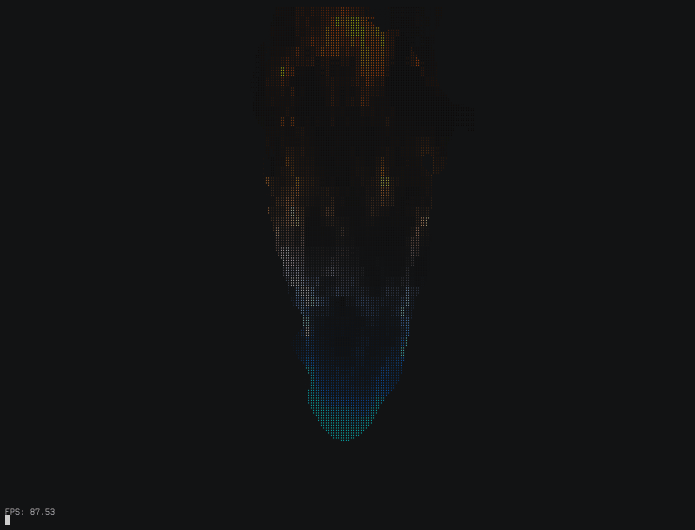

# blotGL

Just messing around with braille rendering using shaders.

I was inspired by [The Cherno](https://github.com/TheCherno)'s [C++ Application Architecture](https://www.youtube.com/watch?v=rUxZ5N77M5E) video.

# build

## Debian/Ubuntu
```sh
./dependencies.sh
make
```

## NixOS
```sh
nix develop
make
```

# examples

NOTE: when run in kitty, they don't flicker, and render at 120 FPS (artificial cap).
If anything, I don't know how to make a GIF that doesn't stutter.




# other

See also my other project [blot](https://github.com/bartman/blot/) that can graph data using braille on the terminal.

